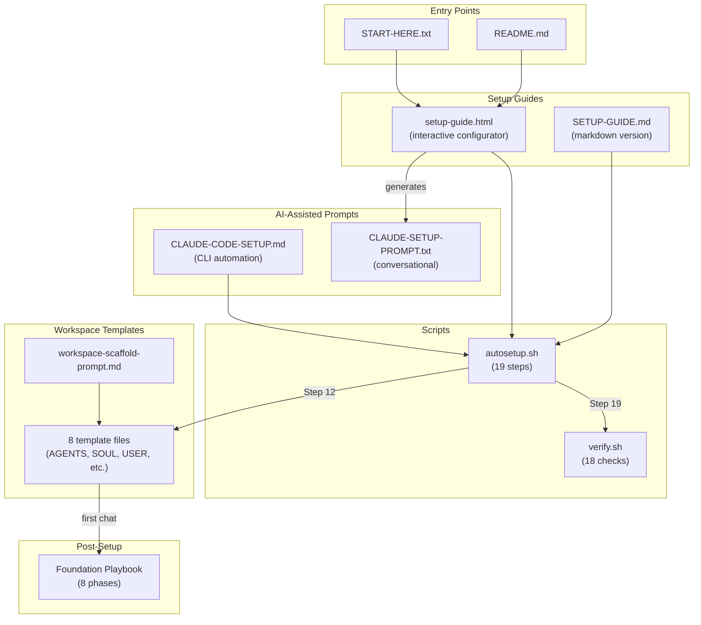
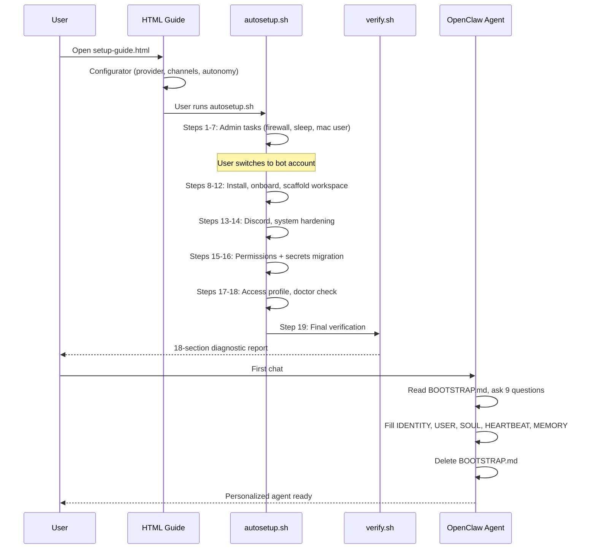
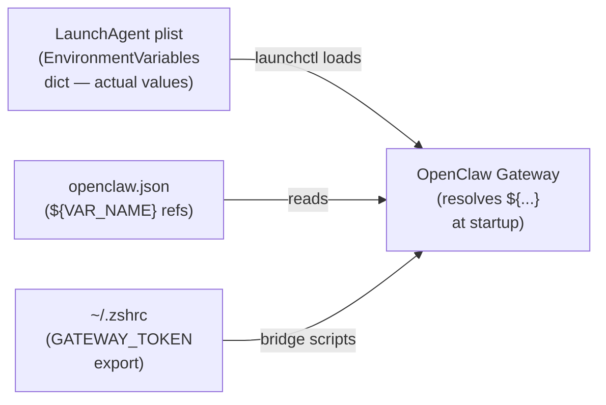
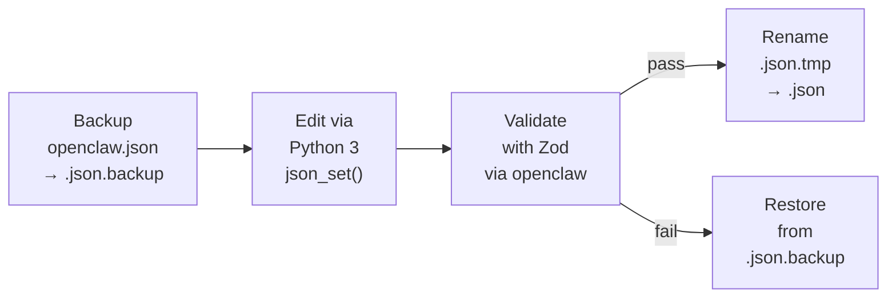

# OpenClaw Setup Package — Codebase Map

## Overview

A complete documentation package for setting up the OpenClaw AI agent framework on macOS. Targets non-technical founders. Written in Bash, HTML/CSS/JS, and Markdown — no build step, no dependencies beyond macOS defaults + Python 3.

The package provides 4 setup paths (interactive HTML, markdown, Claude.ai conversational, Claude Code CLI), 2 automation scripts (19-step autosetup + 18-check verifier), 8 workspace personality templates, and an 8-phase post-setup hardening playbook.



## Directory Structure

```
openclaw-setup/
├── docs/
│   └── CODEBASE_MAP.md              # This file
├── templates/
│   ├── workspace/                    # 8 workspace template files (single source of truth)
│   │   ├── AGENTS.md                 # Operating manual — startup, safety, memory discipline
│   │   ├── BOOTSTRAP.md              # First-run wizard (self-deletes after completion)
│   │   ├── HEARTBEAT.md              # Scheduled check configuration
│   │   ├── IDENTITY.md               # Bot name, emoji, vibe
│   │   ├── MEMORY.md                 # Long-term memory template
│   │   ├── SOUL.md                   # Personality and communication style
│   │   ├── TOOLS.md                  # Infrastructure docs (providers, channels, devices)
│   │   └── USER.md                   # Owner profile and preferences
│   └── workspace-scaffold-prompt.md  # Standalone prompt for manual workspace setup
├── openclaw-autosetup.sh             # Automated 19-step setup script
├── openclaw-verify.sh                # Post-setup diagnostic (18 checks)
├── openclaw-setup-guide.html         # Interactive HTML guide with configurator
├── OPENCLAW-SETUP-GUIDE.md           # Markdown setup guide (8 steps)
├── OPENCLAW-CLAUDE-CODE-SETUP.md     # Claude Code CLI setup prompt (9 steps)
├── OPENCLAW-CLAUDE-SETUP-PROMPT.txt  # Claude.ai conversational setup prompt (8 phases)
├── OPENCLAW-FOUNDATION-PLAYBOOK-TEMPLATE.md  # Post-setup hardening (8 phases)
├── CLAUDE.md                         # Agent reference (this repo)
├── README.md                         # Package index and navigation
├── START-HERE.txt                    # Minimal entry point
├── ROADMAP.md                        # Maintainer roadmap (not user-facing)
├── LICENSE                           # MIT
└── .gitignore
```

## Module Guide

### Root — Setup Guides & Scripts

**Purpose:** Everything needed to go from zero to a running, secured OpenClaw agent on macOS.

**Entry point:** `START-HERE.txt` (points to `openclaw-setup-guide.html`)

| File | Purpose | Tokens |
|------|---------|--------|
| `openclaw-setup-guide.html` | Interactive guide with configurator; generates custom Claude.ai prompt on completion page | 27,024 |
| `openclaw-autosetup.sh` | 19-step automated setup; idempotent steps, progress tracking, atomic config editing, security hardening (secrets migration, mDNS, gateway token) | 22,570 |
| `OPENCLAW-FOUNDATION-PLAYBOOK-TEMPLATE.md` | Post-setup hardening; 8 phases (one/week, Phase 1 urgent), 25 community gotchas appendix | 14,256 |
| `openclaw-verify.sh` | Post-setup diagnostic; 18 check sections incl. FileVault, color-coded pass/fail/warn output | 7,787 |
| `OPENCLAW-SETUP-GUIDE.md` | Markdown version of setup guide; 8 steps, security risks section, glossary | 6,548 |
| `OPENCLAW-CLAUDE-CODE-SETUP.md` | Claude Code CLI prompt; 9 steps with 7 safety rules, troubleshooting | 6,238 |
| `OPENCLAW-CLAUDE-SETUP-PROMPT.txt` | Conversational Claude.ai prompt; 8 phases, Terminal comfort assessment (A/B/C), warm personality | 3,688 |
| `README.md` | Package index with file tables and ASCII decision tree | 1,380 |
| `ROADMAP.md` | Maintainer roadmap; completed items, remaining work, deferred features | 404 |
| `START-HERE.txt` | Absolute minimal entry point: "Open openclaw-setup-guide.html" | 52 |

### Scripts — Security Architecture

Both scripts now implement a comprehensive security hardening layer:

**Python-embedded code safety:** All 22 Python blocks (12 in autosetup, 10 in verify) use `sys.argv` + single-quoted heredocs (`<< 'PYEOF'`) to prevent shell injection. No string interpolation of user data into Python code.

**Secrets migration (autosetup Step 16 — `step_harden_secrets`):**
1. Reads 7 known secret paths from `openclaw.json`
2. Replaces plaintext values with `${ENV_VAR_NAME}` references
3. Stores actual values in LaunchAgent plist `EnvironmentVariables` dict via PlistBuddy
4. Generates cryptographic gateway token (`openssl rand -hex 32`) if missing or weak
5. Disables mDNS/Bonjour via `OPENCLAW_DISABLE_BONJOUR=1`
6. Exports `OPENCLAW_GATEWAY_TOKEN` to `~/.zshrc` for bridge script access

**Known limitation:** OpenClaw gateway resolves `${VAR_NAME}` references and writes plaintext back to `openclaw.json` on restart. The LaunchAgent plist is the canonical secret store.

**Key autosetup functions with line numbers:**
- `progress_init/mark_step/is_step_done/show_progress` (110-210) — JSON progress tracking
- `json_set/json_get/json_validate` (289-392) — Python 3 JSON manipulation
- `atomic_config_edit` (398-462) — backup → edit → validate → rename
- `version_gte` (468-477) — semver comparison via Python
- 19 step functions (569-2238) — see `show_help()` for step descriptions
- `main` (2244-2421) — orchestration with mode detection

**Key verify check functions with line numbers:**
- Sections 1-12 (41-478) — inline checks (user isolation, Node, OpenClaw, config, gateway, Discord, sleep, doctor, logs, access profiles, spending, security)
- Section 13: FileVault (481-491) — `fdesetup status` check
- `check_tcc_permissions` (496-534) — TCC database query
- `check_memory_search` (539-608) — memory provider + API key validation
- `check_api_connectivity` (613-653) — OpenRouter + Discord token check (skips `${...}` refs)
- `check_docker_sandbox` (658-702) — Docker + sandbox mode
- `check_workspace_templates` (707-740) — 7 expected template files

### Templates — Workspace Files

**Purpose:** Starter files for the bot's workspace (`~/.openclaw/workspace/`). Copied during autosetup Step 12 or via the scaffold prompt.

**Entry point:** `templates/workspace-scaffold-prompt.md` (manual setup) or autosetup Step 12 (scripted setup)

| File | Purpose | Tokens |
|------|---------|--------|
| `workspace/AGENTS.md` | Operating manual — startup procedure, memory discipline, safety rules, heartbeat vs. cron decision tree | 2,850 |
| `workspace/HEARTBEAT.md` | Daily check schedule (morning/midday/evening), alert decision tree, gateway watchdog | 2,083 |
| `workspace/MEMORY.md` | Long-term knowledge base — critical rules, owner profile, projects, preferences, lessons, system state | 1,910 |
| `workspace/SOUL.md` | Personality framework — communication principles, boundaries, decision-making | 1,627 |
| `workspace/USER.md` | Owner profile — preferences, projects, working style, automation philosophy | 1,521 |
| `workspace/BOOTSTRAP.md` | First-run wizard — 9 questions, fills IDENTITY/USER/SOUL/HEARTBEAT/MEMORY, self-deletes | 1,359 |
| `workspace-scaffold-prompt.md` | Standalone prompt for workspace setup; creates dirs, copies templates, runs BOOTSTRAP | 809 |
| `workspace/TOOLS.md` | Infrastructure docs — API providers table, channels, connected devices, env vars | 635 |
| `workspace/IDENTITY.md` | Bot's name, nature, vibe, visual identity (emoji) | 506 |

**Template lifecycle:**
1. Templates live in `templates/workspace/` (single source of truth)
2. Autosetup Step 12 copies them with `cp -n` (won't overwrite existing)
3. BOOTSTRAP.md runs on first chat (9 personalization questions)
4. BOOTSTRAP fills in IDENTITY, USER, SOUL, HEARTBEAT, MEMORY
5. BOOTSTRAP self-deletes (signals first-run complete)
6. AGENTS.md governs every subsequent session (startup checklist, safety rules)

## Data Flow

### Setup Flow: Zero to Running Agent



### Secrets Architecture (autosetup Step 16)



### Atomic Config Editing (autosetup.sh pattern)



## Cross-File Consistency

These values MUST stay synchronized across all 7 content files:

| Constant | Value | Files that reference it |
|----------|-------|------------------------|
| Min OpenClaw version | `2026.1.29` | All scripts + all docs |
| Recommended version | `2026.2.9+` | All scripts + all docs |
| CVE (RCE) | `CVE-2026-25253` (CVSS 8.8) | Playbook (full), others (plain English) |
| CVE (cmd injection) | `CVE-2026-25157` | Playbook (full), others (plain English) |
| API key prefix (OpenRouter) | `sk-or-v1-` | Scripts + all docs |
| API key prefix (Anthropic) | `sk-ant-` | Scripts + all docs |
| API key prefix (Voyage AI) | `pa-` | Scripts + all docs |
| Access profiles | Explorer, Guarded, Restricted | Scripts + all docs |
| Workspace templates | 8 files | Autosetup, scaffold prompt, Playbook |

## Conventions

- **Naming:** Files use `OPENCLAW-` prefix + `SCREAMING-KEBAB-CASE` for docs, `lowercase` for scripts. Templates use `UPPERCASE.md`.
- **Cross-file consistency:** All 7 content files reference the same CVE numbers, version thresholds, API key prefixes, and access profiles. When updating one, update all (see table above).
- **CVE language:** User-facing files use plain English ("serious security bug that's been fixed"). CVE numbers kept in scripts and Foundation Playbook for technical contexts.
- **Account-switching flow:** All admin/sudo tasks consolidated into Steps 1-7. User switches to bot user ONCE and stays there.
- **Config editing:** Always atomic — backup, edit with Python 3, validate with Zod, rename or restore. Never edit `~/.openclaw/openclaw.json` directly.
- **Python safety:** All embedded Python uses `sys.argv` + `<< 'PYEOF'` heredocs. Never interpolate shell variables into Python strings.
- **Workspace templates:** Always `cp -n` from `templates/workspace/`. Never heredoc template content into scripts.
- **Backup permissions:** `cp -p` preserves file permissions on backup copies.
- **Color-coded output:** Both scripts use matching style — GREEN/PASS, RED/FAIL, YELLOW/WARN, CYAN/INFO.
- **HTML conditional visibility:** `data-requires` attributes on elements, evaluated against configurator selections. `localStorage` with `sessionStorage` fallback.

## Navigation Guide

> These are the most actionable entries for agents working in this codebase.

- **To add a new setup step:** Add step function in `openclaw-autosetup.sh`, increment `STEP_TOTAL` (line 60), add to `main()` (lines 2295-2369), add to `show_help()` (lines 542-562). Add corresponding page in `openclaw-setup-guide.html`, section in `OPENCLAW-SETUP-GUIDE.md`, step in `OPENCLAW-CLAUDE-CODE-SETUP.md`, phase in `OPENCLAW-CLAUDE-SETUP-PROMPT.txt`. Update step/phase counts in all files.
- **To add a verification check:** Add check function or inline section in `openclaw-verify.sh`, renumber subsequent sections, update results summary (lines 743-768).
- **To modify security hardening:** Touch `step_harden_permissions()` (1756-1856), `step_harden_secrets()` (1858-1993), `step_apply_access_profile()` (1995-2075) in autosetup. Touch sections 12-13 in verify. Update `OPENCLAW-FOUNDATION-PLAYBOOK-TEMPLATE.md` Phase 1 for consistency.
- **To modify workspace templates:** Edit files in `templates/workspace/`. Autosetup copies from here (Step 12). Test with `workspace-scaffold-prompt.md` on a fresh workspace.
- **To update provider/model recommendations:** Touch `openclaw-setup-guide.html` (configurator + tier cards), `OPENCLAW-SETUP-GUIDE.md` (Step 4 tables), `openclaw-autosetup.sh` (DEFAULT_MODEL + FALLBACK_MODEL + Step 10), `OPENCLAW-FOUNDATION-PLAYBOOK-TEMPLATE.md` (Configuration YAML). Keep API key prefixes consistent.
- **To change the account-switching flow:** All admin tasks must stay in Steps 1-7 before Step 8. Touch `openclaw-autosetup.sh`, `openclaw-setup-guide.html` (Step 1), `OPENCLAW-SETUP-GUIDE.md` (Step 1), both Claude prompts (Phase 1).
- **To update CVE references:** Touch all 7 content files: `openclaw-autosetup.sh`, `openclaw-verify.sh`, `openclaw-setup-guide.html`, `OPENCLAW-SETUP-GUIDE.md`, `OPENCLAW-CLAUDE-CODE-SETUP.md`, `OPENCLAW-CLAUDE-SETUP-PROMPT.txt`, `OPENCLAW-FOUNDATION-PLAYBOOK-TEMPLATE.md`. Plain English in user-facing, CVE numbers in technical.
- **To update version thresholds:** Search for `2026.1.29` and `2026.2.9` across all files. Touch `openclaw-autosetup.sh` (MIN_VERSION, REC_VERSION), `openclaw-verify.sh` (version comparison), all docs, HTML guide.
- **To modify first-run personalization:** Edit `templates/workspace/BOOTSTRAP.md` (questions + file-update instructions). Ensure changes flow to IDENTITY, USER, SOUL, HEARTBEAT, MEMORY.
- **To add a new workspace template file:** Create `templates/workspace/NEW.md`, add to autosetup Step 12 copy logic, add to `workspace-scaffold-prompt.md`, document in README workspace table, reference in `templates/workspace/AGENTS.md` startup procedure if core.
- **To debug JSON manipulation issues:** All Python blocks marked with `<< 'PYEOF'` — grep for this pattern. Check `sys.argv` parameter count. Verify single-quoted heredoc delimiter. Test with malformed input.
- **To add a new security feature:** Implement in autosetup (new function or extend `step_harden_secrets`), add check in verify, document in Playbook Phase 1, add mention in all 5 doc files. See ROADMAP.md for pending security doc updates.
