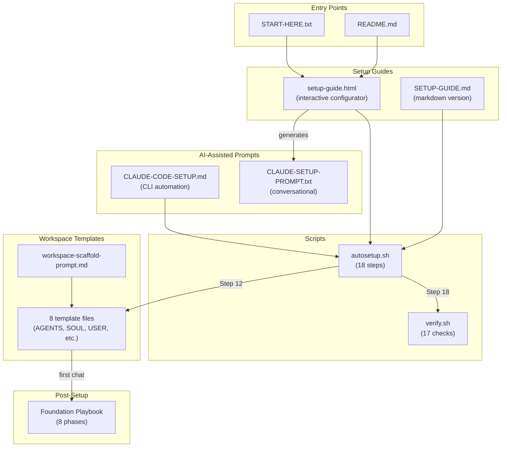
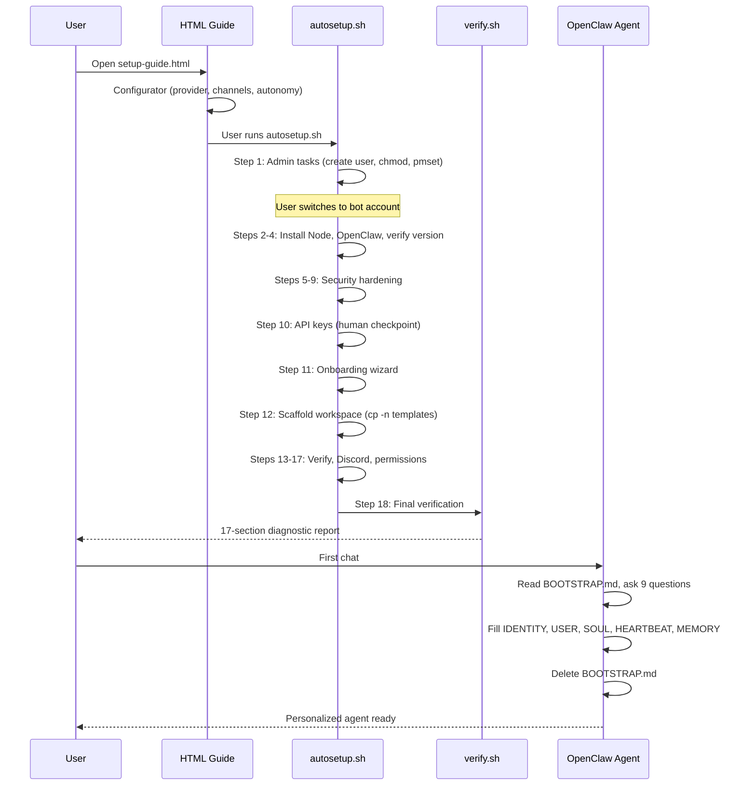
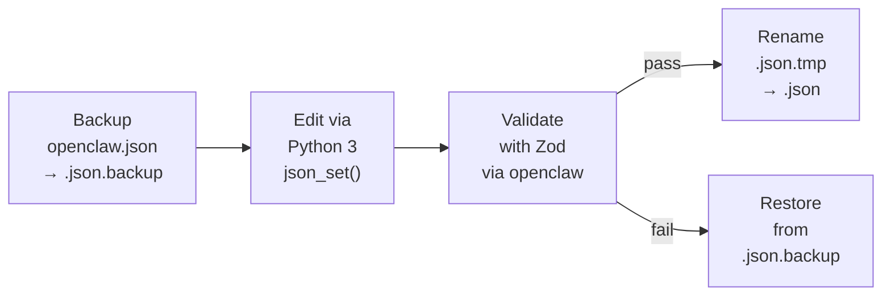

# OpenClaw Setup Package — Codebase Map

## Overview

A 9-file documentation package (plus 8 workspace templates) for setting up the OpenClaw AI agent framework on macOS. Targets non-technical founders. Written in Bash, HTML/CSS/JS, and Markdown — no build step, no dependencies beyond macOS defaults.



## Directory Structure

```
openclaw-setup/
├── docs/
│   └── CODEBASE_MAP.md              # This file
├── templates/
│   ├── workspace/                    # 8 workspace template files (single source of truth)
│   │   ├── AGENTS.md                 # Operating manual — startup, safety, memory discipline
│   │   ├── BOOTSTRAP.md              # First-run wizard (self-deletes after completion)
│   │   ├── HEARTBEAT.md              # Scheduled check configuration
│   │   ├── IDENTITY.md               # Bot name, emoji, vibe
│   │   ├── MEMORY.md                 # Long-term memory template
│   │   ├── SOUL.md                   # Personality and communication style
│   │   ├── TOOLS.md                  # Infrastructure docs (providers, channels, devices)
│   │   └── USER.md                   # Owner profile and preferences
│   └── workspace-scaffold-prompt.md  # Standalone prompt for manual workspace setup
├── openclaw-autosetup.sh             # Automated 18-step setup script
├── openclaw-verify.sh                # Post-setup diagnostic (17 checks)
├── openclaw-setup-guide.html         # Interactive HTML guide with configurator
├── OPENCLAW-SETUP-GUIDE.md           # Markdown setup guide (8 steps)
├── OPENCLAW-CLAUDE-CODE-SETUP.md     # Claude Code CLI setup prompt (9 steps)
├── OPENCLAW-CLAUDE-SETUP-PROMPT.txt  # Claude.ai conversational setup prompt (8 phases)
├── OPENCLAW-FOUNDATION-PLAYBOOK-TEMPLATE.md  # Optional post-setup hardening (8 phases)
├── CLAUDE.md                         # Agent reference (this repo)
├── README.md                         # Package index and navigation
├── START-HERE.txt                    # Minimal entry point
├── ROADMAP.md                        # Maintainer roadmap (not user-facing)
├── LICENSE                           # MIT
└── .gitignore
```

## Module Guide

### Root — Setup Guides & Scripts

**Purpose:** Everything needed to go from zero to a running OpenClaw agent on macOS.

**Entry point:** `START-HERE.txt` (points to `openclaw-setup-guide.html`)

| File | Purpose | Tokens |
|------|---------|--------|
| `openclaw-setup-guide.html` | Interactive guide with configurator; generates custom Claude.ai prompt on completion page | 27,024 |
| `openclaw-autosetup.sh` | 18-step automated setup; idempotent steps, progress tracking, atomic config editing via Python 3 | 20,394 |
| `OPENCLAW-FOUNDATION-PLAYBOOK-TEMPLATE.md` | Optional post-setup hardening; 8 phases (one/week, Phase 1 urgent), 25 community gotchas appendix | 14,256 |
| `openclaw-verify.sh` | Post-setup diagnostic; 17 check sections, color-coded pass/fail/warn output | 7,502 |
| `OPENCLAW-SETUP-GUIDE.md` | Markdown version of setup guide; 8 steps, security risks section, glossary | 6,548 |
| `OPENCLAW-CLAUDE-CODE-SETUP.md` | Claude Code CLI prompt; 9 steps with 7 safety rules, troubleshooting | 6,238 |
| `OPENCLAW-CLAUDE-SETUP-PROMPT.txt` | Conversational Claude.ai prompt; 8 phases, Terminal comfort assessment (A/B/C), warm personality | 3,688 |
| `README.md` | Package index with file tables and ASCII decision tree | 1,345 |
| `ROADMAP.md` | Maintainer roadmap; pre-publish checklist, deferred items, known limitations | 404 |
| `START-HERE.txt` | Absolute minimal entry point: "Open openclaw-setup-guide.html" | 52 |

### Templates — Workspace Files

**Purpose:** Starter files for the bot's workspace (`~/.openclaw/workspace/`). Copied during autosetup Step 12 or via the scaffold prompt.

**Entry point:** `templates/workspace-scaffold-prompt.md` (for manual setup) or autosetup Step 12 (for scripted setup)

| File | Purpose | Tokens |
|------|---------|--------|
| `workspace/AGENTS.md` | Operating manual — startup procedure, memory discipline, safety rules, heartbeat vs. cron decision tree | 2,850 |
| `workspace/HEARTBEAT.md` | Daily check schedule (morning/midday/evening), alert decision tree, gateway watchdog | 2,083 |
| `workspace/MEMORY.md` | Long-term knowledge base — critical rules, owner profile, projects, preferences, lessons, system state | 1,910 |
| `workspace/SOUL.md` | Personality framework — communication principles, boundaries, decision-making | 1,627 |
| `workspace/USER.md` | Owner profile — preferences, projects, working style, automation philosophy | 1,521 |
| `workspace/BOOTSTRAP.md` | First-run wizard — 9 questions, fills IDENTITY/USER/SOUL/HEARTBEAT/MEMORY, self-deletes | 1,359 |
| `workspace-scaffold-prompt.md` | Standalone prompt for workspace setup; creates dirs, copies templates, runs BOOTSTRAP | 809 |
| `workspace/TOOLS.md` | Infrastructure docs — API providers table, channels, connected devices, env vars | 635 |
| `workspace/IDENTITY.md` | Bot's name, nature, vibe, visual identity (emoji) | 506 |

**Template lifecycle:**
1. Templates live in `templates/workspace/` (single source of truth)
2. Autosetup Step 12 copies them with `cp -n` (won't overwrite existing)
3. BOOTSTRAP.md runs on first chat (9 personalization questions)
4. BOOTSTRAP fills in IDENTITY, USER, SOUL, HEARTBEAT, MEMORY
5. BOOTSTRAP self-deletes (signals first-run complete)
6. AGENTS.md governs every subsequent session (startup checklist, safety rules)

## Data Flow

### Setup Flow: Zero to Running Agent



### Atomic Config Editing (autosetup.sh pattern)



## Conventions

- **Naming:** Files use `OPENCLAW-` prefix + `SCREAMING-KEBAB-CASE` for docs, `lowercase` for scripts. Templates use `UPPERCASE.md`.
- **Cross-file consistency:** All 7 content files reference the same CVE numbers (CVE-2026-25253, CVE-2026-25157), version thresholds (min 2026.1.29, recommended 2026.2.9+), API key prefixes (`sk-or-v1-`, `sk-ant-`, `pa-`), and access profiles (Explorer/Guarded/Restricted).
- **CVE language:** User-facing files use plain English ("serious security bug that's been fixed"). CVE numbers kept in scripts and Foundation Playbook for technical contexts.
- **Account-switching flow:** All admin/sudo tasks consolidated into Step 1. User switches to bot user ONCE and stays there.
- **Config editing:** Always atomic — backup, edit with Python 3, validate with Zod, rename or restore. Never edit `~/.openclaw/openclaw.json` directly.
- **Workspace templates:** Always `cp -n` from `templates/workspace/`. Never heredoc template content into scripts.
- **Color-coded output:** Both scripts use matching style — GREEN/PASS, RED/FAIL, YELLOW/WARN, CYAN/INFO.
- **HTML conditional visibility:** `data-requires` attributes on elements, evaluated against configurator selections.

## Navigation Guide

> These are the most actionable entries for agents working in this codebase.

- **To add a new setup step:** Add step function in `openclaw-autosetup.sh`, add page div in `openclaw-setup-guide.html` (with nav logic), add section in `OPENCLAW-SETUP-GUIDE.md`, `OPENCLAW-CLAUDE-CODE-SETUP.md`, and `OPENCLAW-CLAUDE-SETUP-PROMPT.txt`. Update step/phase counts in all files.
- **To modify workspace templates:** Edit files in `templates/workspace/`. Autosetup copies from here (Step 12). Test with `workspace-scaffold-prompt.md` on a fresh workspace.
- **To update provider/model recommendations:** Touch `openclaw-setup-guide.html` (configurator + tier cards), `OPENCLAW-SETUP-GUIDE.md` (Step 4 tables), `openclaw-autosetup.sh` (DEFAULT_MODEL + FALLBACK_MODEL + Step 10), `OPENCLAW-FOUNDATION-PLAYBOOK-TEMPLATE.md` (Configuration YAML). Keep API key prefixes consistent.
- **To change the account-switching flow:** All admin tasks must stay in Step 1 before the switch. Touch `openclaw-autosetup.sh` (Steps 1-7 before Step 8), `openclaw-setup-guide.html` (Step 1), `OPENCLAW-SETUP-GUIDE.md` (Step 1), both Claude prompts (Phase 1).
- **To update CVE references:** Touch all 7 content files (not START-HERE.txt, not ROADMAP.md): `openclaw-autosetup.sh`, `openclaw-setup-guide.html`, `OPENCLAW-SETUP-GUIDE.md`, `OPENCLAW-CLAUDE-CODE-SETUP.md`, `OPENCLAW-CLAUDE-SETUP-PROMPT.txt`, `OPENCLAW-FOUNDATION-PLAYBOOK-TEMPLATE.md`, `openclaw-verify.sh`. Plain English in user-facing, CVE numbers in technical.
- **To add a Foundation Playbook phase:** Add Phase section in `OPENCLAW-FOUNDATION-PLAYBOOK-TEMPLATE.md`, update phase count in header + Pre-Flight Q7, add checkpoint, update Completion Checklist.
- **To modify first-run personalization:** Edit `templates/workspace/BOOTSTRAP.md` (questions + file-update instructions). Ensure changes flow to IDENTITY, USER, SOUL, HEARTBEAT, MEMORY.
- **To add a verification check:** Add `check_X()` function in `openclaw-verify.sh`, call from main flow, update section numbers and results summary.
- **To update version thresholds:** Search for `2026.1.29` and `2026.2.9` across all files. Touch `openclaw-autosetup.sh` (MIN_VERSION, REC_VERSION), `openclaw-verify.sh` (version comparison), all docs, HTML guide (Step 3).
- **To add a new workspace template file:** Create `templates/workspace/NEW.md`, add to autosetup Step 12 copy logic, add to `workspace-scaffold-prompt.md`, document in README workspace table, reference in `templates/workspace/AGENTS.md` startup procedure if core.
